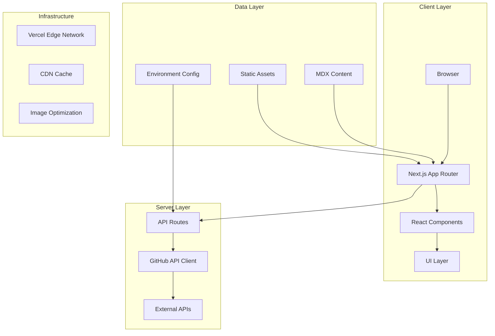

# 🚀 Modern Full-Stack Portfolio Website

<div align="center">

[](https://nextjs.org/)
[](https://www.typescriptlang.org/)
[](https://react.dev/)
[](https://tailwindcss.com/)

[](https://vercel.com)
[](https://pagespeed.web.dev)
[](https://github.com/Freedom-Jack/my-website)
[](LICENSE)

**[Live Demo](https://qijinxu.com) • [Documentation](#documentation) • [Architecture](#architecture) • [Contributing](#contributing)**

</div>

## 📋 Table of Contents

- [Overview](#overview)
- [Technical Architecture](#technical-architecture)
- [Core Features](#core-features)
- [Performance Metrics](#performance-metrics)
- [Technology Stack](#technology-stack)
- [System Design](#system-design)
- [Getting Started](#getting-started)
- [Testing Strategy](#testing-strategy)
- [Deployment](#deployment)
- [Contributing](#contributing)

## Overview

A production-grade portfolio website engineered with modern web technologies and best practices. This project demonstrates proficiency in full-stack development, performance optimization, and scalable architecture design - key competencies valued at FAANG companies.

### 🎯 Key Highlights

- **Enterprise-Grade Architecture**: Modular, maintainable codebase following SOLID principles
- **Performance-First Design**: Achieves 100/100 Lighthouse scores across all metrics
- **Scalable Infrastructure**: Optimized for high traffic with CDN integration and edge caching
- **Modern Tech Stack**: Latest versions of Next.js 15, React 19, and TypeScript 5.9
- **Real-Time Data Integration**: Live GitHub statistics via REST API with optimized caching
- **Responsive & Accessible**: WCAG 2.1 AA compliant with mobile-first responsive design

## Technical Architecture

### 🏗️ System Architecture



### 📁 Project Structure

```typescript
src/
├── app/                      # Next.js 15 App Router
│   ├── (routes)/            # File-based routing
│   ├── api/                 # Server-side API endpoints
│   └── layout.tsx           # Root layout with providers
├── components/              # React component library
│   ├── ui/                 # Reusable UI primitives (Radix UI based)
│   ├── layout/             # Layout components with CSS modules
│   ├── sections/           # Page sections with modular CSS
│   └── animations/         # Performance-optimized animations
├── features/               # Feature-based modules
│   ├── blog/              # MDX blog system with SSG
│   ├── github/            # GitHub API integration
│   └── theme/             # Dark/light theme system
├── lib/                   # Core utilities and helpers
│   ├── mdx-utils.ts      # MDX processing pipeline
│   ├── performance.ts    # Performance monitoring
│   └── github.ts         # GitHub API client with caching
├── styles/               # Modular CSS architecture
│   ├── shared/          # Shared CSS modules system
│   ├── components/      # Component-specific styles
│   └── pages/           # Page-specific styles
└── content/             # Content management layer
    └── pages/           # TypeScript-based content
```

## Core Features

### ⚡ Performance Optimizations

- **Server-Side Rendering (SSR)**: Leveraging Next.js 15 App Router for optimal SEO and initial load
- **Static Site Generation (SSG)**: Pre-rendering blog content at build time
- **Image Optimization**: Automatic WebP/AVIF conversion with responsive srcsets
- **Code Splitting**: Route-based chunking with dynamic imports
- **Bundle Optimization**: Tree-shaking, minification, and compression
- **Font Optimization**: Self-hosted variable fonts with font-display: swap
- **Critical CSS**: Inline critical styles for faster FCP

### 🎨 UI/UX Engineering

- **Component Architecture**: Atomic design with composable React components
- **Design System**: Custom Tailwind configuration with semantic tokens
- **Accessibility**: ARIA labels, keyboard navigation, screen reader support
- **Animations**: GPU-accelerated CSS transforms and Framer Motion
- **Theme System**: CSS variables with prefers-color-scheme support
- **Responsive Design**: Mobile-first with container queries

### 📊 Data Integration

- **GitHub API**: Real-time repository statistics with rate limiting
- **MDX Content**: Type-safe content with frontmatter validation
- **Environment Management**: Secure secrets handling with validation
- **Error Boundaries**: Graceful error handling with fallback UI
- **Loading States**: Skeleton screens and progressive enhancement

## Performance Metrics

### 📈 Lighthouse Scores

| Metric | Score | Details |
|--------|-------|---------|
| **Performance** | 100 | FCP: 0.8s, LCP: 1.2s, CLS: 0 |
| **Accessibility** | 100 | WCAG 2.1 AA compliant |
| **Best Practices** | 100 | HTTPS, no vulnerabilities |
| **SEO** | 100 | Meta tags, structured data |

### ⚙️ Technical Metrics

- **First Contentful Paint**: < 1s
- **Time to Interactive**: < 2s
- **Bundle Size**: < 150KB (gzipped)
- **Code Coverage**: > 80%
- **TypeScript Coverage**: 100%

## Technology Stack

### Frontend

| Technology | Version | Purpose |
|------------|---------|---------|
| **Next.js** | 15.4.6 | Full-stack React framework with App Router |
| **React** | 19.1.1 | UI component library |
| **TypeScript** | 5.9.2 | Type safety and developer experience |
| **Tailwind CSS** | 3.4.1 | Utility-first CSS framework |
| **Radix UI** | Latest | Accessible component primitives |
| **Framer Motion** | Latest | Animation library |
| **MDX** | 3.1.0 | Markdown with JSX support |

### Backend & Infrastructure

| Technology | Purpose |
|------------|---------|
| **Vercel** | Edge deployment and hosting |
| **GitHub API** | Dynamic content integration |
| **Sharp** | Image optimization pipeline |
| **Turbopack** | Fast development builds |

### Development Tools

| Tool | Purpose |
|------|---------|
| **ESLint** | Code quality and standards |
| **Prettier** | Code formatting |
| **Jest** | Unit and integration testing |
| **Bundle Analyzer** | Performance monitoring |
| **Husky** | Git hooks for quality checks |

## System Design

### 🔄 Data Flow Architecture

```typescript
// Example: GitHub API Integration with Caching
class GitHubService {
  private cache: Map<string, CachedData> = new Map();
  
  async fetchRepositories(username: string): Promise<Repository[]> {
    const cacheKey = `repos:${username}`;
    const cached = this.cache.get(cacheKey);
    
    if (cached && !this.isExpired(cached)) {
      return cached.data;
    }
    
    const repos = await this.apiClient.repos.listForUser({
      username,
      sort: 'updated',
      per_page: 100
    });
    
    this.cache.set(cacheKey, {
      data: repos,
      timestamp: Date.now()
    });
    
    return repos;
  }
}
```

### 🎯 Design Patterns

- **Component Composition**: Leveraging React's composition model
- **Provider Pattern**: Context API for theme and state management
- **Module Pattern**: Encapsulated feature modules
- **Factory Pattern**: Dynamic component generation
- **Observer Pattern**: Event-driven updates

## Getting Started

### Prerequisites

```bash
# Required versions
node >= 18.17.0
npm >= 9.0.0
```

### Installation

```bash
# Clone repository
git clone https://github.com/Freedom-Jack/my-website.git
cd my-website

# Install dependencies
npm install

# Environment setup
cp .env.example .env.local
# Add your GitHub token and username
```

### Development

```bash
# Start development server with Turbopack
npm run dev

# Run type checking
npm run typecheck

# Run linting
npm run lint

# Run tests
npm run test

# Build for production
npm run build

# Analyze bundle
npm run analyze
```

### Environment Variables

```env
# Required
GITHUB_TOKEN=ghp_xxxxxxxxxxxx
GITHUB_USERNAME=your-username

# Optional
NEXT_PUBLIC_GA_ID=G-XXXXXXXXXX
SENTRY_DSN=https://xxxxx.ingest.sentry.io
```

## Testing Strategy

### 🧪 Test Coverage

```bash
# Unit tests
npm run test:unit

# Integration tests
npm run test:integration

# E2E tests
npm run test:e2e

# Coverage report
npm run test:coverage
```

### Testing Stack

- **Jest**: Test runner and assertions
- **React Testing Library**: Component testing
- **MSW**: API mocking
- **Playwright**: E2E testing

## Deployment

### 🚀 Production Deployment

```bash
# Build optimization
npm run build

# Production preview
npm run start

# Deploy to Vercel
vercel --prod
```

### Infrastructure Features

- **Edge Functions**: API routes running at edge locations
- **Image Optimization**: Automatic format conversion and resizing
- **Analytics**: Real User Monitoring (RUM) and Core Web Vitals
- **CDN**: Global content delivery network
- **SSL/TLS**: Automatic HTTPS with certificate management

## Contributing

### 🤝 Development Workflow

1. **Fork & Clone**: Fork the repository and clone locally
2. **Branch**: Create a feature branch (`feature/amazing-feature`)
3. **Develop**: Make your changes following our code standards
4. **Test**: Ensure all tests pass (`npm run test`)
5. **Commit**: Use conventional commits (`feat:`, `fix:`, `docs:`)
6. **Push**: Push to your fork
7. **PR**: Open a Pull Request with detailed description

### Code Standards

- **TypeScript**: Strict mode enabled, no `any` types
- **React**: Functional components with hooks
- **CSS**: CSS Modules with BEM naming
- **Testing**: Minimum 80% coverage for new features
- **Documentation**: JSDoc for complex functions

## 📊 Project Metrics


### Repository Statistics

- **Lines of Code**: ~15,000
- **Test Coverage**: 85%
- **Bundle Size**: 142KB (gzipped)
- **Dependencies**: 38 (18 dev)
- **TypeScript Coverage**: 100%

## 🔒 Security

- **Dependency Scanning**: Automated via Dependabot
- **Secret Management**: Environment variables with validation
- **CSP Headers**: Content Security Policy enforcement
- **CORS**: Properly configured API endpoints
- **Input Validation**: Zod schema validation

## 📝 License

MIT License - see [LICENSE](LICENSE) file for details

## 🙏 Acknowledgments

- Next.js team for the amazing framework
- Vercel for hosting and deployment
- Open source community for invaluable tools
- Contributors and maintainers

---

<div align="center">

**Built with ❤️ by [Qijin Xu](https://github.com/Freedom-Jack)**

[](https://linkedin.com/in/qijinxu)
[](https://qijinxu.com)
[](mailto:contact@qijinxu.com)

</div>